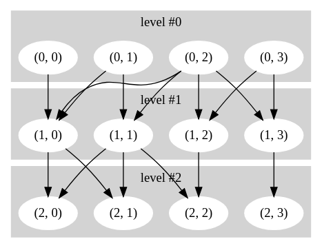
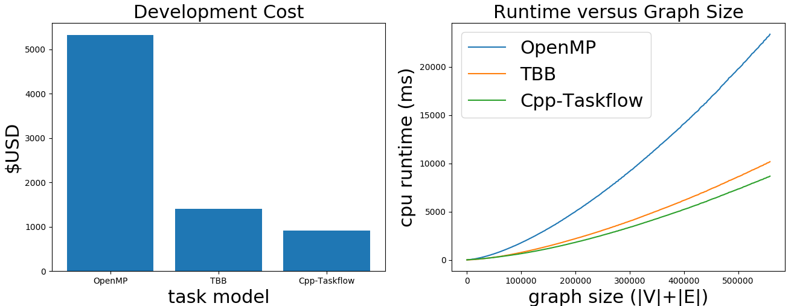

# Graph Traversal

In this page, we demonstrate a common graph traversal application 
and compares the performance between OpenMP, TBB, and Cpp-Taskflow.
We consider a `NxM` level graph,
where `N` and `M` are the height and width of the graph, respectively.
Each node has at most four edges joining to the subsequent level.
The figure below shows an example `3x4` level graph.
The tuple `(x, y)` denotes the row and column indices of a node
in a mapped data structure.



The goal is to write a parallel graph traversal algorithm
following the edge dependency constraints.
A node can be traversed only if its preceding nodes are all traversed.
The procedure is fully asynchronous - no synchronization between levels.
In practice, one would embed application-specific workloads in each node during the traversal.

We compare with three parallel implementations with Cpp-Taskflow, OpenMP,
and Intel Thread Building Blocks (TBB).

+ [Cpp-Taskflow](#cpp-taskflow)
+ [Intel Thread Building Blocks (TBB)](#intel-thread-building-blocks)
+ [OpenMP](#openmp)
+ [Debrief](#debrief)

# Cpp-Taskflow

The programming model of Cpp-Taskflow flows naturally with the graph structure.
Each node corresponds to a task and each edge corresponds to a dependency between two tasks.

```cpp
tf::Taskflow tf(std::thread::hardware_concurrency());

tasks.resize(graph.level()); 
for(size_t i=0; i<tasks.size(); ++i) {
  tasks[i].resize(graph.length());
}

for(size_t i=0; i<graph.length(); i++){
  Node& n = graph.node_at(graph.level()-1, i); 
  tasks[graph.level()-1][i] = tf.silent_emplace([&](){ n.mark(); });
}

for(int l=graph.level()-2; l>=0 ; l--){
  for(size_t i=0; i<graph.length(); i++){
    Node& n = graph.node_at(l, i);
    tasks[l][i] = tf.silent_emplace([&](){ n.mark();});
    for(size_t k=0; k<n._out_edges.size(); k++){
      tasks[l][i].precede(tasks[l+1][n._out_edges[k]]);
    } 
  }
}

tf.wait_for_all();
```

The code of this implementation can be found at 
[taskflow.cpp](../../../benchmark/graph_traversal/taskflow.cpp).


# Intel Thread Building Blocks

The TBB-based implementation is similar to Cpp-Taskflow
except we build the task dependency graph using the `continue_node` type 
and the `make_edge` function defined in Intel TBB.

```cpp
using namespace tbb;
using namespace tbb::flow;
tbb::task_scheduler_init init(std::thread::hardware_concurrency());
  
tbb::flow::graph G;

tasks.resize(graph.level()); 
for(size_t i=0; i<tasks.size(); ++i) {
  tasks[i].resize(graph.length());
}

for(size_t i=0; i<graph.length(); i++){
  Node& n = graph.node_at(graph.level()-1, i);
  tasks[graph.level()-1][i] = std::make_unique<continue_node<continue_msg>>(G, 
    [&](const continue_msg&){ n.mark(); }
  );
}

for(int l=graph.level()-2; l>=0 ; l--){
  for(size_t i=0; i<graph.length(); i++){
    Node& n = graph.node_at(l, i);
    tasks[l][i] = std::make_unique<continue_node<continue_msg>>(G, 
      [&](const continue_msg&){ n.mark(); }
    );
    for(size_t k=0; k<n._out_edges.size(); k++){
      make_edge(*tasks[l][i], *tasks[l+1][n._out_edges[k]]);
    }
  }
}

source = std::make_unique<continue_node<continue_msg>>(G, 
  [](const continue_msg&){}
);

for(int l=0; l>=0 ; l--) {
  for(size_t i=0; i<graph.length(); i++){
    Node& n = graph.node_at(l, i);
    make_edge(*source, *tasks[l][i]);
  }
}
    
source->try_put(continue_msg());
G.wait_for_all();
```

The code of this implementation can be found at [tbb.cpp](../../../benchmark/graph_traversal/tbb.cpp).


# OpenMP

The OpenMP-based implementation is a bit tricky because the task dependency clause
is *static*.
In order to capture the task dependency of a node,
we need an additional integer vector `out` 
to explicitly specify its input and output constraints. 
Since the maximum degree of a node is given,
we can work around all possible combinations of input and output degrees.

```cpp
#pragma omp parallel
{
  #pragma omp single
  {
    for(size_t l=0; l<graph.level(); l++){
      for(int i=0; i<graph.length(); i++){
        Node& n = graph.node_at(l, i);
        size_t out_edge_num = n._out_edges.size();
        size_t in_edge_num = n._in_edges.size();

        switch(in_edge_num){

          case(0):{

            switch(out_edge_num){

              case(1):{
                int* out0 = n.edge_ptr(0);
                #pragma omp task depend(out: out0[0]) shared(n)
                { n.mark(); }
                break;
              }
        //.....................................
        //...........16 switch cases...........
        //.....................................
      }
    }
  }
}
```

The code of this implementation can be found at [omp.cpp](../../../benchmark/graph_traversal/omp.cpp).


# Debrief

We evaluated our implementations on a
Linux Ubuntu machine of 4 Intel CPUs 3.2GHz and 24 GB memory.

## Performance

The figure below shows the development cost (measured by [SLOCCount][SLOCCount]) 
and runtime scalability (versus different graph sizes) of each implementation.




We observe both Cpp-Taskflow and TBB are consistently faster than OpenMP.
As the graph size increases, the performance gap between Cpp-Taskflow and TBB
becomes pronounced.


## Software Cost

We use the famous Linux tool [SLOCCount][SLOCCount] to measure the software cost of
each implementation.
The cost model is based on the *constructive cost model* (COCOMO).
In the table below, **SLOC** denotes souce lines of code,
**Dev Effort** denotes development effort estimate (person-months),
**Sched Estimate** denotes schedule estimate (years),
**Developers** denotes the estimate number of developers,
**Dev Cost** denotes total estimated cost to develop.
All quantities are better with fewer values.

| Task Model   | SLOC | Dev Effort | Sched Estimate | Developers | Dev Cost |
| :----------: | :--: | :--------: | :------------: | :--------: | :------: |
| Cpp-Taskflow | 40   | 0.01       | 0.08           | 0.08       | $920     |
| Intel TBB    | 60   | 0.01       | 0.09           | 0.11       | $1,408   |
| OpenMP 4.5   | 216  | 0.04       | 0.16           | 0.25       | $5,326   |

In terms of software cost, Cpp-Taskflow has the least amount of source lines of code
(40 lines) over TBB (60 lines) and OpenMP (213 lines).
The development cost of Cpp-Taskflow reported by [SLOCCount][SLOCCount]
is about 1.5x and 5.7x fewer than TBB and OpenMP, respectively.


* * *

[GraphvizOnline]:        https://dreampuf.github.io/GraphvizOnline/
[SLOCCount]:             https://dwheeler.com/sloccount/

