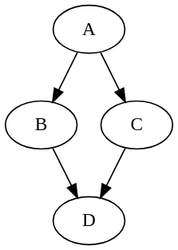

# C0: Write Your First Cpp-Taskflow Program

In this chapter, we are going to demonstrate how to write a Cpp-Taskflow's
"hello world" program.

+ [Set up Cpp-Taskflow](#set-up-cpp-taskflow)
+ [Create a Simple Taskflow Graph](#create-a-simple-taskflow-graph)
+ [Compile and Run](#compile-and-run)

# Set up Cpp-Taskflow

Cpp-Taskflow is header-only. To use it, simpley copy and drop the folder [taskflow](../../taskflow)
to your project and add it to your compiler's include path. 

```bash
# clone the cpp-taskflow repo to your local 
~$ git clone https://github.com/cpp-taskflow/cpp-taskflow.git
~$ ls
cpp-taskflow/

# now copy the headers to your project
~$ mkdir simple
~$ cp -r cpp-taskflow/taskflow/ simple/
~$ cd simple
~$ ls
taskflow/

# create a source
~$ touch simple.cpp
```

# Create a Simple Taskflow Graph

We now create a simple graph of four tasks A, B, C, and D, 
and four dependencies such that 
task A runs before tasks B and C, 
and Task D runs after tasks B and C.



With Cpp-Taskflow, the code to this dependency graph is shown as follows:

```cpp
1:  #include <taskflow/taskflow.hpp>  // the only include you need
2: 
3:  int main(){
4:   
5:    tf::Taskflow tf(std::thread::hardware_concurrency());
6:
7:    auto [A, B, C, D] = tf.silent_emplace(  // create four tasks with structured binding
8:      [] () { std::cout << "TaskA\n"; },
9:      [] () { std::cout << "TaskB\n"; },
10:     [] () { std::cout << "TaskC\n"; },
11:     [] () { std::cout << "TaskD\n"; } 
12:   );
13:     
14:   A.precede(B);  // B runs after A
15:   A.precede(C);  // C runs after A
16:   B.precede(D);  // D runs after B
17:   C.precede(D);  // D runs after C
18:
19:   A.name("TaskA");
20:   B.name("TaskB");
21:   C.name("TaskC");
22:   D.name("TaskD");
23:   std::cout << tf.dump();
24:                                   
25:   tf.wait_for_all();  // block until finished
26: 
27:   return 0;
28: }
```

Debrief:
+ Line 1 is the only include you need to use Cpp-Taskflow in your program.
+ Line 5 creates a taskflow object, which is the main gateway
  to create dependency graphs and dispatch them for execution
+ Line 7-12 creates four tasks in terms of callable objects (lambda) using
  the method `silent_emplace`
+ Line 14-17 adds dependency constraints using the method `precede` 
  to force A to run before B and C, and D to run after B and C
+ Line 19-22 names these four tasks and dumps the dependency graph
  to a dot format which can be visualized through [GraphvizOnline][GraphVizOnline]
+ Line 24 dispatches the dependency graph to execution and blocks until the graph
  finishes

The method `silent_emplace` can take arbitrary number of callable objects and return
a tuple of `tasks` representing internal graph nodes.
A `task` is nothing but a lightweight object that allows users to associate different attributes
such as adding dependencies, naming the task, and so on.


# Compile and Run

To compile a Cpp-Taskflow application, you need a C++17 compiler.
Throughout the wiki, we will use g++7.2 as an example. Similar concepts apply to other compilers.

```bash
~$ g++ simple.cpp -I . -std=c++1z -O2 -lpthread -o simple
~$ ./simple
TaskA
TaskC
TaskB
TaskD
```

Notice that you will need to add `.` to the include paths so the compiler can correctly
find the taskflow headers. 
Depending on the runtime, there are two possible outcomes of this program, 
due to the fact TaskB and TaskC can run at the same time.

```bash
# another possible outcome of this program
~$ ./simple
TaskA
TaskB
TaskC
TaskD
```

* * *

[GraphvizOnline]:        https://dreampuf.github.io/GraphvizOnline/

