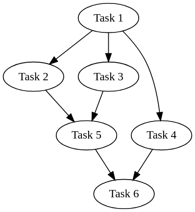

# Motivation behind Cpp-Taskflow

Cpp-Taskflow is motivated by the fact that 
the evolution of computer architecture is moving toward multicore designs,
and the insufficiencies of existing parallel programming tools in support for modern C++.
In this section, we first brief the history of computer architecture
and then discuss the necessity of parallel programming.
We will show different parallel programming paradigms and the motivation behind Cpp-Taskflow.

+ [The Era of Multicore](#the-era-of-multicore)
+ [Parallel Programming](#parallel-programming)
+ [Challenges of Task-based Parallel Programming](#challenges-of-task-based-parallel-programming)
+ [The Project Mantra](#our-project-mantra)

# The Era of Multicore

In the past, we embrace *free* performance scaling on our software thanks to 
advances in manufacturing technologies and micro-architectural innovations.
Approximately for every 1.5 year we can speed up our programs by simply switching to new
hardware and compiler vendors that brings 2x more transistors, faster clock rates, 
and higher instruction-level parallelism.
However, this paradigm was challenged by the power wall and increasing difficulties in exploiting
instruction-level parallelism.
The boost to computing performance has stemmed from changes to multicore chip designs.

The above sweeping visualization (thanks to Prof. Mark Horowitz and his group) 
shows the evolution of computer architectures is moving toward multicore designs.
Today, multicore processors and multiprocessor systems are common
in many electronic products such as mobiles, laptops, desktops, and servers.
In order to keep up with the performance scaling, 
it is becoming necessary for software developers to write parallel programs 
that utilize the number of available cores.

# Parallel Programming

## Loop-level Parallelism

The most basic and simplest concept of parallel programming is *loop-level parallelism*,
exploiting parallelism that exists among the iterations of a loop.
The program typically partitions a loop of iterations into a set of of blocks,
either fixed or dynamic,
and run each block in parallel. Below the figure illustrates this pattern.

The main advantage of the loop-based approach is its simplicity in 
speeding up a regular workload in line with [Amdahl's Law][Amdahl's Law].
Programmers only need to discover independence of each iteration within a loop 
and, once possible, the parallel decomposition strategy can be easily implemented.
Many existing libraries have built-in support to write a parallel-for loop.

## Task-based Parallel Programming

The traditional the loop-level parallelism is simple but hardly allows users 
to exploit parallelism in more irregular applications such as graph algorithms,
incremental flows, recursion, and dynamically-allocated data structures.
To address these challenges,
parallel programming and libraries are evolving from tradition loop-based parallelism to the
the *task-based* model.

The above figure shows an example *task dependency graph*.
Each node in the graph represents a task unit at function level and each
edge indicates the task dependency between a pair of tasks.
Task-based model offers a powerful means to express both regular 
and irregular parallelism in a top-down manner, 
and provides transparent scaling to large number of cores.
In fact, it has been proven, both by the research community and 
the evolution of parallel programming standards, 
task-based approach scales the best with future processor generations and architectures.

# Challenges of Task-based Parallel Programming

Parallel programs are notoriously hard to write correctly, 
regardless of loop-based approach or task-based model.
A primary reason is *data dependency*,
some data cannot be accessed until some other data becomes available.
This dependency constraint introduces a number of challenges
such as data race, thread contention, and consistencies
when writing a correct parallel program.
We believe the most effective way to overcome 
these obstacles is a suitable task-based programming model,
as it affects software developments in various aspects, such as programmability,
debugging effort, development costs, efficiencies, etc.

Cpp-Taskflow addresses a long-standing challenge, 
"*how can we make it easier for developers to 
write efficient C++ parallel programs under the presence of
complex task dependencies?*"
By easy and efficient we mean the productivity in writing
performant software that scales with increasing number of cores.

# The Project Mantra

The goal of Cpp-Taskflow is simple -
*We aim to help C++ developers quickly write parallel programs and 
implement efficient parallel decomposition strategies using the task-based approach*.
We want developers to write simple and effective parallel code, specifically with the following objectives:

+ Expressiveness
+ Readability 
+ Transparency

In a nutshell, code written with Cpp-Taskflow explains itself.
The transparency allows developers to forget about the difficult thread managements at programming time.
They can focus on high-level implementation of parallel decomposition algorithms,
leaving the concurrency details and scalability handled by Cpp-Taskflow.

* * *

[Amdahl's Law]:    https://en.wikipedia.org/wiki/Amdahl%27s_law

